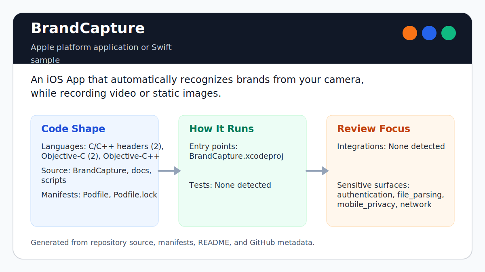
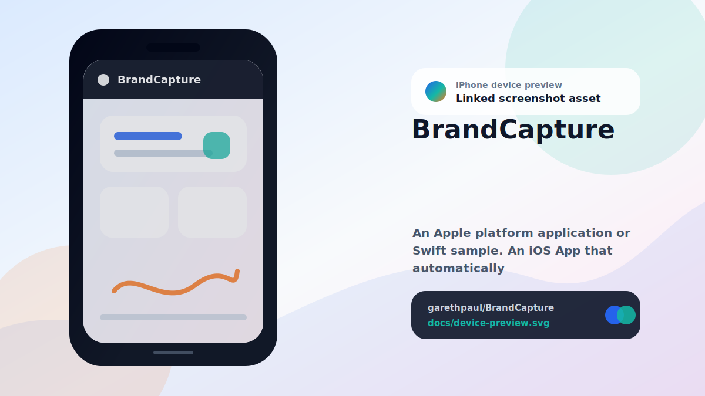

# BrandCapture

<!-- README-OVERVIEW-IMAGE -->


## Device Preview

<!-- DEVICE-PREVIEW-IMAGE -->


## Overview

`garethpaul/BrandCapture` is an Apple platform application or Swift sample. An iOS App that automatically recognizes brands from your camera, while recording video or static images.

This README is based on the checked-in source, manifests, scripts, and repository metadata on the `master` branch. The project language mix found during review was: C/C++ headers (2), Objective-C (2), Objective-C++ (2), C++ (1), shell (1).

## Repository Contents

- `README.md` - project overview and local usage notes
- `Podfile` - Apple platform dependency metadata
- `BrandCapture` - source or example code
- `BrandCapture.xcodeproj` - Xcode project file
- `docs` - source or example code
- `Podfile.lock` - Apple platform dependency metadata
- `scripts` - source or example code
- `SECURITY.md` - security reporting and disclosure guidance
- `VISION.md` - project direction and maintenance guardrails

Additional scan context:

- Source directories: BrandCapture, docs, scripts
- Dependency and build manifests: Podfile, Podfile.lock
- Entry points or build surfaces: BrandCapture.xcodeproj
- Test-looking files: no obvious test files detected

## Getting Started

### Prerequisites

- Git
- macOS with Xcode for building Apple platform projects
- CocoaPods if dependencies need to be installed

### Setup

```bash
git clone https://github.com/garethpaul/BrandCapture.git
cd BrandCapture
pod install
```

The setup commands above are derived from repository files. Legacy mobile, Python, or JavaScript samples may require older SDKs or package versions than a modern workstation uses by default.

## Running or Using the Project

- Open `BrandCapture.xcworkspace` in Xcode, choose the `BrandCapture` scheme, and run it on the matching simulator/device.

## Testing and Verification

Run the SDK-free source baseline check first:

```sh
make check
scripts/check-baseline.sh
```

The legacy baseline is Objective-C++ camera processing, OpenCV 2.4.9, CocoaPods 1.0.1 provenance, bundle identifier `com.gpj.BrandCapture`, and iOS deployment target 8.0.

This host does not have `xcodebuild` or `pod`, so full build, simulator/device, and CocoaPods verification must happen on a macOS machine with the matching legacy toolchain.

When the required SDK or runtime is unavailable, use static checks and source review first, then verify on a machine that has the matching platform toolchain.

## Configuration and Secrets

- No required secret or credential file was identified in the repository scan. If you add integrations later, keep secrets out of git.

## Security and Privacy Notes

- Review changes touching authentication or token handling; examples from the scan include docs/plans/2026-06-08-brandcapture-camera-opencv-baseline.md.
- Review changes touching network requests, sockets, or service endpoints; examples from the scan include BrandCapture/Info.plist, BrandCapture/main.cpp.
- Review changes touching mobile permissions or privacy-sensitive device data; examples from the scan include BrandCapture/Info.plist, BrandCapture/main.cpp, docs/plans/2026-06-08-brandcapture-camera-opencv-baseline.md, scripts/check-baseline.sh.
- Review changes touching file, media, JSON, XML, CSV, OCR, or data parsing; examples from the scan include BrandCapture/Info.plist, BrandCapture/ViewController.mm, BrandCapture/main.cpp, docs/plans/2026-06-08-brandcapture-camera-opencv-baseline.md, and 1 more.

## Maintenance Notes

- This looks like an Apple platform project or sample. Xcode, Swift, CocoaPods, and deployment target versions may need to match the original project era.
- Capture controls mirror detector and camera state: Start is disabled while
  capture is active, and Stop remains disabled until capture is active.
- The capture-control storyboard outlets are wired so the state-sync helper
  reaches the Start, Stop, and toolbar controls.
- The preview image outlet is validated before camera setup so missing
  storyboard wiring leaves capture disabled.
- The grayscale conversion uses an explicit device-gray color space with
  one-channel bitmap info before handing frames to OpenCV.
- UIImage conversions use CGImage pixel dimensions instead of point-based image
  sizes when allocating OpenCV buffers.
- Feature detection skips descriptor extraction when no scene keypoints are
  detected, keeping empty camera frames on the same explicit no-corners path as
  failed matches.
- The camera permission text describes user-started local target-image detection
  and no microphone or location permission copy is declared.
- See `SECURITY.md` for vulnerability reporting and safe research guidance.
- See `VISION.md` for project direction and contribution guardrails.
- See `CHANGES.md` for the maintenance history.
- See `docs/plans/2026-06-09-brandcapture-scene-keypoint-guard.md` for the
  empty scene-keypoint detection baseline.
- See `docs/plans/2026-06-09-brandcapture-camera-permission-copy.md` for the
  camera permission copy baseline.
- See `docs/plans/2026-06-09-brandcapture-preview-outlet-guard.md` for the
  camera preview outlet guard.
- See `docs/plans/2026-06-09-brandcapture-image-pixel-dimensions.md` for the
  image conversion pixel-dimension baseline.
- See `docs/plans/2026-06-08-brandcapture-check-wrapper.md` for the root
  verification wrapper baseline.

## Contributing

Keep changes small and tied to the project that is already present in this repository. For code changes, document the toolchain used, avoid committing generated dependency directories or local configuration, and update this README when setup or verification steps change.
