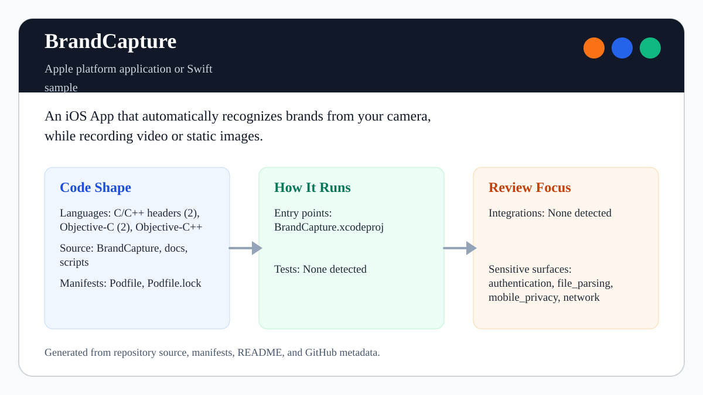

# BrandCapture

<!-- README-OVERVIEW-IMAGE -->


## Overview

`garethpaul/BrandCapture` is an Apple platform application or Swift sample. An iOS App that automatically recognizes brands from your camera, while recording video or static images.

This README is based on the checked-in source, manifests, scripts, and repository metadata on the `master` branch. The project language mix found during review was: C/C++ headers (2), Objective-C (2), Objective-C++ (2), C++ (1), shell (1).

## Repository Contents

- `README.md` - project overview and local usage notes
- `Podfile` - Apple platform dependency metadata
- `BrandCapture` - source or example code
- `BrandCapture.xcodeproj` - Xcode project file
- `docs` - source or example code
- `Podfile.lock` - Apple platform dependency metadata
- `scripts` - source or example code
- `SECURITY.md` - security reporting and disclosure guidance
- `VISION.md` - project direction and maintenance guardrails

Additional scan context:

- Source directories: BrandCapture, docs, scripts
- Dependency and build manifests: Podfile, Podfile.lock
- Entry points or build surfaces: BrandCapture.xcodeproj
- Test-looking files: no obvious test files detected

## Getting Started

### Prerequisites

- Git
- macOS with Xcode for building Apple platform projects
- CocoaPods if dependencies need to be installed

### Setup

```bash
git clone https://github.com/garethpaul/BrandCapture.git
cd BrandCapture
pod install
```

The setup commands above are derived from repository files. Legacy mobile, Python, or JavaScript samples may require older SDKs or package versions than a modern workstation uses by default.

## Running or Using the Project

- Open `BrandCapture.xcworkspace` in Xcode, choose the `BrandCapture` scheme, and run it on the matching simulator/device.

## Legacy Build and Camera Verification

Treat the checked-in project metadata as a historical compatibility contract,
not a claim that current Apple tooling can build it unchanged. The Xcode project
declares Xcode 6.3 compatibility, the app target keeps an iOS deployment target
8.0, `Podfile.lock` records CocoaPods 1.0.1, and the dependency graph pins OpenCV
2.4.9. Run `pod install` without regenerating the lockfile, then open
`BrandCapture.xcworkspace` and build the `BrandCapture` scheme from the same
exact commit used for verification.

The bundled detector reference is `BrandCapture/clipper.jpg`, selected by
`BrandCaptureReferenceImageName` in `BrandCapture/ViewController.mm`. A new
brand example must update the bundled asset, project membership, the constant,
and privacy-safe verification fixture together; replacing only the file name or
only the image leaves the detector contract ambiguous.

Use a simulator only for build, launch, storyboard, and capture-control smoke
checks. The simulator cannot provide camera evidence for permission, live frame
processing, target detection, overlay geometry, orientation, or sustained
capture. Those rows require a physical iOS device, a controlled synthetic copy
of the reference image, and the exact-commit matrix in
[`DEVICE_VERIFICATION.md`](DEVICE_VERIFICATION.md).

On a physical device, exercise permission denial and grant, start and stop
controls, valid and missing reference setup, background/foreground transitions,
weak frames, valid overlay alignment, rotation, and bounded sustained capture.
Do not store or upload camera frames, include people or private surroundings,
or treat a successful build as camera or overlay evidence.

## Testing and Verification

Run the SDK-free source baseline check first:

```sh
make check
scripts/check-baseline.sh
```

GitHub Actions runs `make check` through `.github/workflows/check.yml` on
pushes, pull requests, and manual dispatches. The workflow uses a
commit-pinned checkout action, read-only repository access, and a bounded
runtime.
The job does not persist checkout credentials after source retrieval.

The legacy baseline is Objective-C++ camera processing, OpenCV 2.4.9, CocoaPods 1.0.1 provenance, bundle identifier `com.gpj.BrandCapture`, and iOS deployment target 8.0.

When `xcodebuild` or `pod` is unavailable, full build, simulator/device, and CocoaPods verification must happen on a macOS machine with the matching legacy toolchain.

Use [`DEVICE_VERIFICATION.md`](DEVICE_VERIFICATION.md) for the exact-commit
BrandCapture matrix. It covers permission, reference setup, descriptor and
geometry rejection, valid overlays, controls, orientation, lifecycle,
sustained capture, privacy-safe evidence, and explicit unexecuted rows.

When the required SDK or runtime is unavailable, use static checks and source review first, then verify on a machine that has the matching platform toolchain.

## Configuration and Secrets

- No required secret or credential file was identified in the repository scan. If you add integrations later, keep secrets out of git.

## Security and Privacy Notes

- Review changes touching authentication or token handling; examples from the scan include docs/plans/2026-06-08-brandcapture-camera-opencv-baseline.md.
- Review changes touching network requests, sockets, or service endpoints; examples from the scan include BrandCapture/Info.plist, BrandCapture/main.cpp.
- Review changes touching mobile permissions or privacy-sensitive device data; examples from the scan include BrandCapture/Info.plist, BrandCapture/main.cpp, docs/plans/2026-06-08-brandcapture-camera-opencv-baseline.md, scripts/check-baseline.sh.
- Review changes touching file, media, JSON, XML, CSV, OCR, or data parsing; examples from the scan include BrandCapture/Info.plist, BrandCapture/ViewController.mm, BrandCapture/main.cpp, docs/plans/2026-06-08-brandcapture-camera-opencv-baseline.md, and 1 more.

## Maintenance Notes

- This looks like an Apple platform project or sample. Xcode, Swift, CocoaPods, and deployment target versions may need to match the original project era.
- Capture controls mirror detector and camera state: Start is disabled while
  capture is active, and Stop remains disabled until capture is active.
- Active or starting capture stops when the application resigns active. During
  the first system camera-permission prompt, authorization intent waits for the
  paired foreground return; entering the background still cancels that attempt.
- A stop request with a missing camera reference still clears active capture state
  and refreshes the controls instead of leaving the UI stuck in capture mode.
- Camera startup is gated by AVFoundation authorization and remains pending until
  the current capture session reports that it started; generation-tagged callbacks
  prevent delayed permission or session events from reactivating stopped capture,
  including callbacks from an older permission prompt.
- The capture-control storyboard outlets are wired so the state-sync helper
  reaches the Start, Stop, and toolbar controls.
- The preview image outlet is validated before camera setup so missing
  storyboard wiring leaves capture disabled.
- The grayscale conversion uses an explicit device-gray color space with
  one-channel bitmap info before handing frames to OpenCV.
- Image matrix layout validation rejects unsupported depths and channel counts,
  and non-contiguous Mats are cloned before UIKit byte export.
- UIImage conversions use CGImage pixel dimensions instead of point-based image
  sizes when allocating OpenCV buffers.
- UIImage conversion catches OpenCV allocation failures and returns an empty
  Mat before either color or grayscale Core Graphics context creation.
- The desktop OpenCV sample stays out of the iOS target sources while remaining
  in the project navigator for historical review.
- The camera callback contains OpenCV frame-processing exceptions so an invalid
  frame is dropped without unwinding through the video delegate.
- Feature detection skips descriptor extraction when no scene keypoints are
  detected, keeping empty camera frames on the same explicit no-corners path as
  failed matches.
- Feature matching retains exact descriptor matches at the inclusive
  three-times-minimum distance boundary, including a zero-distance best match.
- Feature matching rejects non-finite matcher distances before calculating the
  minimum-distance threshold or collecting homography inputs.
- Reference setup clears stale published detector state, stages reference image,
  keypoint, and descriptor state locally, and publishes it only after complete
  OpenCV validation succeeds.
- Detected corners pass a one-square-pixel projected-area guard before the
  detector returns them or the camera callback draws an overlay.
- BrandCapture rejects non-convex projected quadrilaterals before overlay drawing.
- Projected corner behavior is executed by `make test` with framework-independent
  C++ cases for valid ordering and fail-closed geometry.
- The camera permission text describes user-started local target-image detection
  and no microphone or location permission copy is declared.
- Root Makefile checks and the optional Xcode build resolve paths from the
  Makefile location, so `make -f` works outside the checkout directory.
- Xcode prefix-header settings use the checked-in `BrandCapture/Brand-Capture-Prefix.pch`
  path instead of a developer-local absolute path.
- The repository-derived Make root cannot be redirected with a caller-supplied ROOT value.
- See `SECURITY.md` for vulnerability reporting and safe research guidance.
- See `VISION.md` for project direction and contribution guardrails.
- See `CHANGES.md` for the maintenance history.
- See `docs/plans/2026-06-09-brandcapture-scene-keypoint-guard.md` for the
  empty scene-keypoint detection baseline.
- See `docs/plans/2026-06-09-brandcapture-camera-permission-copy.md` for the
  camera permission copy baseline.
- See `docs/plans/2026-06-09-brandcapture-preview-outlet-guard.md` for the
  camera preview outlet guard.
- See `docs/plans/2026-06-09-brandcapture-image-pixel-dimensions.md` for the
  image conversion pixel-dimension baseline.
- See `docs/plans/2026-06-09-brandcapture-maincpp-target-prune.md` for the
  desktop OpenCV sample target-prune baseline.
- See `docs/plans/2026-06-08-brandcapture-check-wrapper.md` for the root
  verification wrapper baseline.
- See `docs/plans/2026-06-10-ci-baseline.md` for the GitHub Actions baseline.
- See `docs/plans/2026-06-10-brandcapture-camera-inactive-lifecycle.md` for the
  application-inactive camera shutdown guard.
- See `docs/plans/2026-06-13-brandcapture-zero-distance-matches.md` for the
  exact descriptor-match threshold boundary.
- See `docs/plans/2026-06-13-brandcapture-finite-match-distance.md` for the
  fail-closed matcher-distance boundary.
- See `docs/plans/2026-06-13-brandcapture-reference-setup.md` for atomic,
  fail-closed reference detector initialization.
- See `docs/plans/2026-06-14-brandcapture-device-verification-checklist.md`
  for the camera/OpenCV device evidence matrix and runtime non-claims.

## Contributing

Keep changes small and tied to the project that is already present in this repository. For code changes, document the toolchain used, avoid committing generated dependency directories or local configuration, and update this README when setup or verification steps change.
